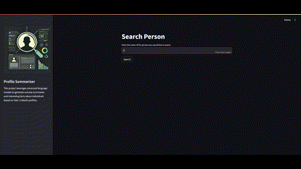

# Profile Summarizer Using Agents


## Overview

This project leverages advanced language models to generate concise summaries and interesting facts about individuals based on their LinkedIn profiles. By inputting a name, the system scrapes LinkedIn for relevant information, processes the data through a series of prompts, and outputs a brief summary along with notable details about the person. Ideal for quick insights and background checks, this tool streamlines the process of gathering professional information.

This project is based on a Udemy course [link to the course](https://www.udemy.com/course/langchain/?couponCode=MTST7102224B2) with various modifications.

This Project Focuses on utilizing `small` Opensource LLMS like `llama3 8B` and running locally. By providing more `tools` to agents we can take full advantage of smaller LLMS.

## Features

- **LinkedIn Profile Lookup**: Automatically fetches LinkedIn profile URLs based on the provided name.
- **Profile Summarization**: Generates a concise summary of the individual's professional background.
- **Interesting Facts Extraction**: Extracts and displays notable details about the person.

## Installation

1. **Clone the repository**:
    ```sh
    git clone https://github.com/yourusername/Profile-summarizer-using-agents.git
    cd Profile-summarizer-using-agents
    ```

2. **Create and activate a virtual environment**:
    ```sh
    python -m venv venv
    source venv/bin/activate  # On Windows, use `venv\Scripts\activate`
    ```

3. **Install the required dependencies**:
    ```sh
    pip install -r requirements.txt
    ```

4. **Install Ollama**
    Install Ollama and pull `llama3` model.

5. **Set up environment variables**:
    Create a `.env` file in the root directory and add your environment variables. For example:
    ```env
    PROXYCURL_API_KEY=your_key
    TAVILY_API_KEY=your_key
    ```
    You will need (FREE):
    * Create an account on proxycurl to get an API key
    * Tavily AI account
## Usage

1. **Run the Streamlit app**:
    ```sh
    ./run.sh
    ```
